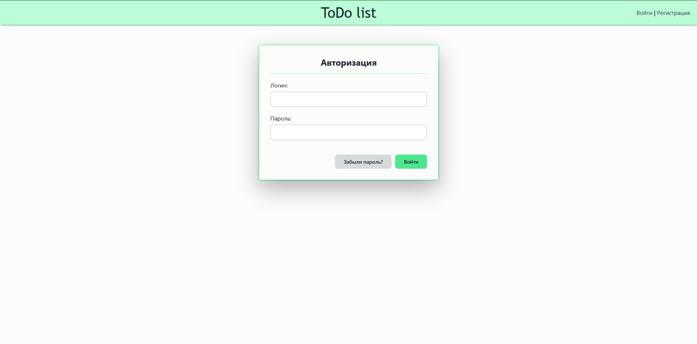
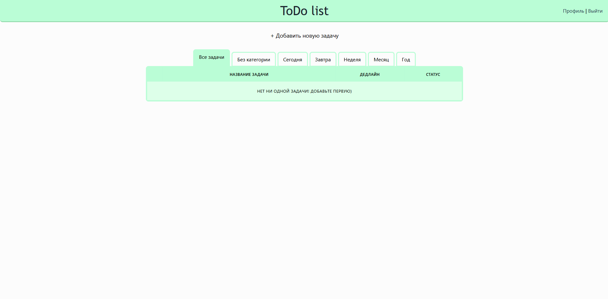
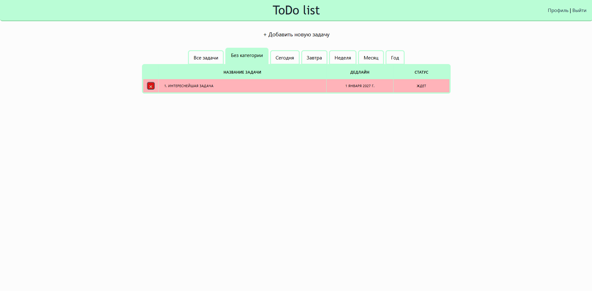

# Small pet-project to organize tasks

## Preview




## Installation

```bash
# 1. Clone the repository
git clone https://github.com/lunica200/ToDo-List.git
cd ToDo-List

# 2. Create and activate a virtual environment
python -m venv venv
venv\Scripts\activate        # Windows
source venv/bin/activate     # macOS / Linux

# 3. Install dependencies
pip install -r requirements.txt

# 4. Configure environment variables
cp .env.example .env

# 5. Apply database migrations
python manage.py migrate

# 6. Create an admin superuser
python manage.py createsuperuser

# 7. Start the development server
python manage.py runserver
```

Open **http://127.0.0.1:8000** in your browser.
